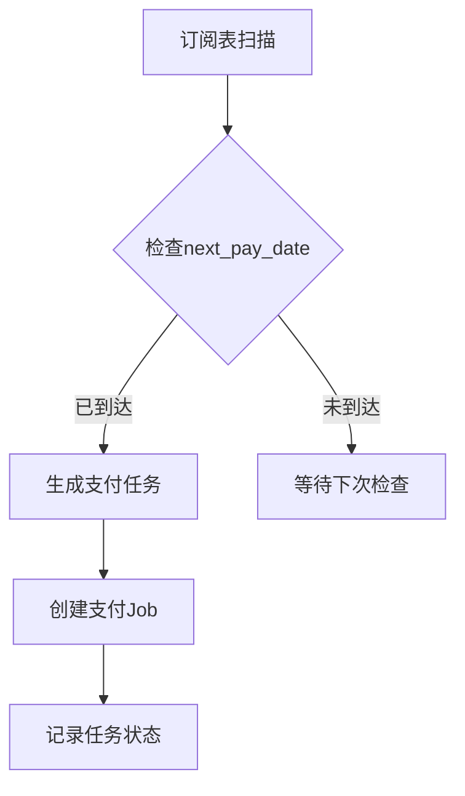
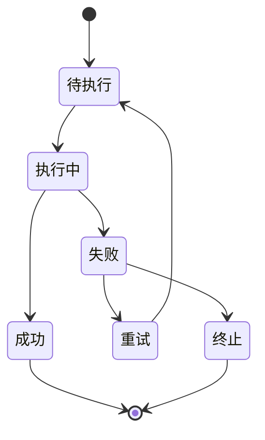
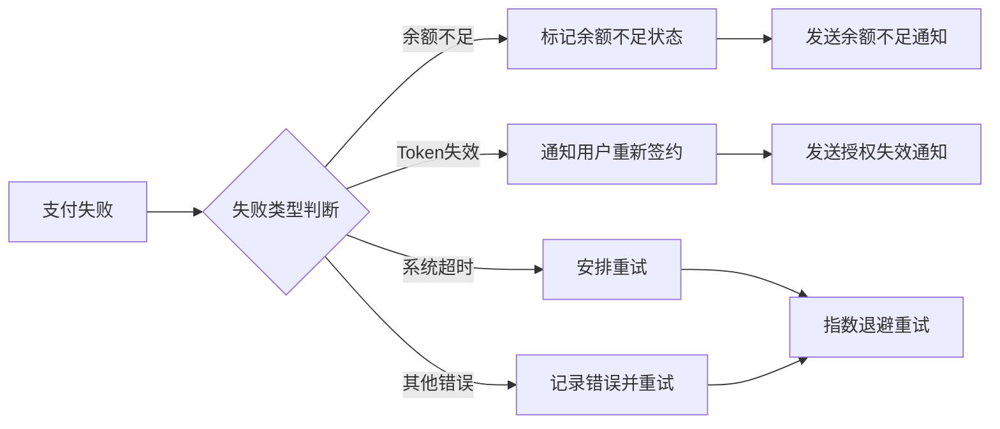

# 订阅支付系统 PRD

## 文档信息

| 项目 | 内容 |
|------|------|
| 文档名称 | 订阅支付系统产品需求文档 |
| 版本 | v1.0 |
| 创建日期 | 2026-03-20 |
| 支付网关 | Evonet |
| 支付方式 | T-Wallet 钱包支付、银行卡快捷支付 |

---

## 1. 产品概述

### 1.1 产品背景

本系统为商户提供周期性订阅/自动续费能力，支持用户一次签约授权后，后续由系统自动完成扣款，无需用户重复参与支付流程。

### 1.2 核心价值

- **用户侧**：一次签约，自动续费，避免服务中断
- **商户侧**：降低续费流失率，提升用户留存

### 1.3 支付方式

| 支付方式 | 说明 |
|----------|------|
| T-Wallet | 手机钱包支付，支持指纹/脸部生物识别验证 |
| 银行卡快捷支付 | 通过 Evonet 网关调用银行快捷支付接口 |

---

## 2. 业务流程

### 2.1 流程阶段划分

订阅支付分为两个阶段：

| 阶段 | 说明 | 用户参与 |
|------|------|----------|
| **Phase 1** | 首次签约与首笔支付，生成 RecurringToken | 需要参与验证 |
| **Phase 2** | 周期性自动续费（MIT） | 无需参与 |

### 2.2 整体流程图

```
用户选择订阅
      ↓
┌─────────────────────────────────┐
│     Phase 1: 首次签约            │
│  - 用户验证身份                  │
│  - 首笔扣款                      │
│  - 生成 RecurringToken           │
│  - 保存Token到数据库              │
└─────────────────────────────────┘
      ↓
┌─────────────────────────────────┐
│   Phase 2: 周期性自动续费 (MIT)   │
│  - 使用已保存的Token              │
│  - 商户发起扣款（用户无感）        │
│  - 支持失败重试                   │
└─────────────────────────────────┘
      ↓
   取消订阅（用户主动或失败）
```

---

## 3. 功能需求

### 3.1 Phase 1：首次签约

#### 3.1.1 T-Wallet 钱包支付

| 步骤 | 交互 | 说明 |
|------|------|------|
| 1 | 用户 → 商户后端 | 选择订阅计划 |
| 2 | 商户后端 → 支付网关 | 创建 Session (`setup_future_usage=off_session`) |
| 3 | 支付网关 → 用户 | 返回支付配置 |
| 4 | 用户 → T-Wallet | 唤起指纹/脸部验证 |
| 5 | T-Wallet → 用户 | 返回加密支付数据 |
| 6 | 用户 → 支付网关 | 提交支付数据 |

**成功分支**：
| 步骤 | 交互 | 说明 |
|------|------|------|
| 7a | 支付网关内部 | 扣款并生成持久化 RecurringToken |
| 8a | 支付网关 → 商户后端 | 返回支付成功 + RecurringToken |
| 9a | 商户后端内部 | 绑定用户 ID 与 RecurringToken（存入数据库）|
| 10a | 商户后端 → 用户 | 通知签约成功 |

**失败分支 - 余额不足**：
| 步骤 | 交互 | 说明 |
|------|------|------|
| 7b | 支付网关 → 用户 | 返回余额不足错误 |
| 8b | 支付网关 → 商户后端 | 签约失败（不生成Token）|
| 9b | 商户后端 → 用户 | 提示充值或更换支付方式 |

#### 3.1.2 银行卡快捷支付

| 步骤 | 交互 | 说明 |
|------|------|------|
| 1 | 用户 → 商户系统 | 选择商品/服务，同意协议并支付 |
| 2 | 商户系统 → 支付网关 | 请求签约/绑卡 (Create Session) |
| 3 | 支付网关 → 发卡银行 | 调用银行快捷支付接口 |
| 4 | 发卡银行 → 支付网关 | 返回验证要求（短信/密码/生物识别）|
| 5 | 支付网关 → 用户 | 展示验证页面/跳转银行App |
| 6 | 用户 → 发卡银行 | 完成验证（通过银行App/短信验证码）|

**成功分支**：
| 步骤 | 交互 | 说明 |
|------|------|------|
| 7a | 发卡银行 → 支付网关 | 验证成功，返回 token/PaymentMethodID |
| 8a | 支付网关 → 商户系统 | 返回签约成功及 token |
| 9a | 商户系统内部 | 保存token到数据库，关联用户reference |
| 10a | 商户系统 → 用户 | 通知签约/支付成功 |

**失败分支 - 余额不足**：
| 步骤 | 交互 | 说明 |
|------|------|------|
| 7b | 发卡银行 → 支付网关 | 返回余额不足 |
| 8b | 支付网关 → 商户系统 | 返回签约失败 |
| 9b | 商户系统 → 用户 | 通知扣款失败，提示充值或换卡 |

### 3.2 Phase 2：周期性自动续费（MIT）

#### 3.2.1 T-Wallet 钱包支付

| 步骤 | 交互 | 说明 |
|------|------|------|
| 1 | 商户后端 → 支付网关 | 发起支付 (RecurringToken, `off_session=true`) |

**成功分支**：
| 步骤 | 交互 | 说明 |
|------|------|------|
| 2a | 支付网关内部 | 内部扣款（无需用户参与）|
| 3a | 支付网关 → 商户后端 | 返回扣款成功 |
| 4a | 商户后端 → 用户 | 推送扣款成功通知 |

**失败分支 - Token失效/过期**：
| 步骤 | 交互 | 说明 |
|------|------|------|
| 2b | 支付网关 → 商户后端 | 返回失败（Token失效）|
| 3b | 商户后端 → 用户 | 通知重新授权 |
| 4b | 用户 → 商户后端 | 重新发起签约流程 |

**失败分支 - 余额不足/其他错误**：
| 步骤 | 交互 | 说明 |
|------|------|------|
| 2c | 支付网关 → 商户后端 | 返回失败原因 |
| 3c | 商户后端内部 | 记录失败，安排重试 |
| 4c | 商户后端 → 用户 | 通知扣款失败，提示处理 |

#### 3.2.2 银行卡快捷支付

| 步骤 | 交互 | 说明 |
|------|------|------|
| 1 | 商户系统 → 支付网关 | 发起代扣请求（提供token、金额、订单号）|
| 2 | 支付网关 → 发卡银行 | 凭token请求扣款（无需用户参与）|

**成功分支**：
| 步骤 | 交互 | 说明 |
|------|------|------|
| 3a | 发卡银行 → 支付网关 | 扣款成功 |
| 4a | 支付网关 → 商户系统 | Webhook回调 + 同步返回成功 |
| 5a | 商户系统 → 用户 | 推送扣款成功通知 |

**失败分支 - Token失效/卡片过期**：
| 步骤 | 交互 | 说明 |
|------|------|------|
| 3b | 发卡银行 → 支付网关 | 返回Token无效 |
| 4b | 支付网关 → 商户系统 | 返回失败，要求重新签约 |
| 5b | 商户系统 → 用户 | 通知用户重新绑卡 |

**失败分支 - 余额不足/限额超限**：
| 步骤 | 交互 | 说明 |
|------|------|------|
| 3c | 发卡银行 → 支付网关 | 返回失败原因 |
| 4c | 支付网关 → 商户系统 | 返回失败 |
| 5c | 商户系统内部 | 记录失败，安排重试（指数退避）|
| 6c | 商户系统 → 用户 | 通知扣款失败，提示充值 |

### 3.3 取消订阅

| 步骤 | 交互 | 说明 |
|------|------|------|
| 1 | 用户 → 商户系统 | 发起取消订阅 |
| 2 | 商户系统 → 支付网关 | 请求注销/停用 RecurringToken |
| 3 | 支付网关 → 发卡银行 | 通知银行解约（银行卡支付）|
| 4 | 发卡银行 → 支付网关 | 确认解约（银行卡支付）|
| 5 | 支付网关 → 商户系统 | 返回解约成功/确认Token已失效 |
| 6 | 商户系统内部 | 更新用户订阅状态为已取消 |
| 7 | 商户系统 → 用户 | 通知取消成功 |

---

## 4. API 规范

### 4.1 Phase 1：首次签约请求

#### 4.1.1 请求参数

```json
{
  "userInfo": {
    "reference": "your_user_reference"      // 用户唯一标识
  },
  "paymentMethod": {
    "recurringProcessingModel": "Subscription"  // 固定值：订阅模式
  },
  "amount": {
    "value": 1000,
    "currency": "CNY"
  }
}
```

#### 4.1.2 响应参数（成功）

```json
{
  "resultCode": "Authorised",
  "paymentMethod": {
    "token": "RecurringToken_XYZ123..."      // 持久化Token
  }
}
```

#### 4.1.3 Token 获取方式

| 方式 | 说明 |
|------|------|
| Webhook 回调 | 支付成功后，网关主动回调商户接口 |
| 查询接口 | 商户主动调用查询接口获取支付结果 |

### 4.2 Phase 2：周期性代扣请求

#### 4.2.1 请求参数

```json
{
  "paymentMethod": {
    "token": {
      "value": "RecurringToken_XYZ123..."   // Phase 1 保存的token
    },
    "recurringProcessingModel": "Subscription"  // 固定值：订阅模式
  },
  "amount": {
    "value": 1000,
    "currency": "CNY"
  },
  "merchantTransID": "ORD_20260320_001",   // 跟踪订单号
  "captureAfterHours": 0                    // 延迟自动捕获小时数（可选）
}
```

#### 4.2.2 手动捕获

| 方式 | 说明 |
|------|------|
| 自动捕获 | 设置 `captureAfterHours` 参数，延迟指定小时后自动捕获 |
| 手动捕获 | 调用 `POST /capture` 接口手动完成捕获 |

---

## 5. 数据存储

### 5.1 用户订阅表（user_subscription）

| 字段 | 类型 | 说明 |
|------|------|------|
| id | BIGINT | 主键 |
| user_id | BIGINT | 用户ID |
| user_reference | VARCHAR(64) | 用户标识（与支付网关对接）|
| payment_method | TINYINT | 支付方式：1-钱包，2-银行卡 |
| recurring_token | VARCHAR(255) | 支付网关返回的持久化Token |
| plan_id | BIGINT | 订阅计划ID |
| amount | DECIMAL(10,2) | 订阅金额 |
| currency | VARCHAR(3) | 币种 |
| cycle_type | TINYINT | 周期类型：1-月，2-季，3-年 |
| status | TINYINT | 状态：1-正常，2-暂停，3-取消 |
| next_pay_date | DATE | 下次扣款日期 |
| created_at | DATETIME | 创建时间 |
| updated_at | DATETIME | 更新时间 |

### 5.2 支付记录表（payment_record）

| 字段 | 类型 | 说明 |
|------|------|------|
| id | BIGINT | 主键 |
| user_id | BIGINT | 用户ID |
| subscription_id | BIGINT | 订阅ID |
| merchant_trans_id | VARCHAR(64) | 商户订单号 |
| gateway_trans_id | VARCHAR(64) | 网关交易流水号 |
| amount | DECIMAL(10,2) | 支付金额 |
| status | TINYINT | 状态：1-成功，2-失败，3-处理中 |
| fail_reason | VARCHAR(255) | 失败原因 |
| retry_count | INT | 重试次数 |
| created_at | DATETIME | 创建时间 |

---

## 6. 异常处理

### 6.1 错误码定义

| 错误码 | 说明 | 处理策略 |
|--------|------|----------|
| PAYMENT_INSUFFICIENT | 余额不足 | 提示用户充值，安排重试 |
| PAYMENT_TOKEN_INVALID | Token失效/过期 | 通知用户重新授权 |
| PAYMENT_CARD_EXPIRED | 卡片过期 | 通知用户更换卡片 |
| PAYMENT_LIMIT_EXCEEDED | 超出限额 | 提示用户调整限额或换卡 |
| PAYMENT_TIMEOUT | 支付超时 | 安排重试 |
| PAYMENT_SYSTEM_ERROR | 系统异常 | 安排重试，记录日志 |

### 6.2 重试策略

| 场景 | 重试策略 |
|------|----------|
| 余额不足 | 指数退避：1h → 4h → 24h → 72h，最多4次 |
| 系统超时 | 指数退避：5min → 15min → 1h，最多3次 |
| Token失效 | 不重试，要求用户重新签约 |

### 6.3 用户通知

| 场景 | 通知方式 | 通知内容 |
|------|----------|----------|
| 签约成功 | 站内信 + 短信 | 订阅成功通知，包含下次扣款时间 |
| 续费成功 | 站内信 + 短信 | 扣款成功通知，包含订单号和金额 |
| 续费失败 | 站内信 + 短信 | 扣款失败通知，包含失败原因 |
| 余额不足 | 站内信 + 短信 | 余额不足提醒，提示充值 |
| Token失效 | 站内信 + 短信 | 授权失效提醒，引导重新签约 |

---

## 7. 安全要求

### 7.1 数据安全

| 要求 | 说明 |
|------|------|
| Token 加密存储 | RecurringToken 必须加密后存储 |
| 敏感信息脱敏 | 日志中脱敏银行卡号、手机号等 |
| 传输加密 | 全链路使用 HTTPS |
| 签名验证 | Webhook 回调必须验证签名 |

### 7.2 风控策略

| 策略 | 说明 |
|------|------|
| 限额控制 | 单笔/单日/单月交易限额 |
| 异常检测 | 异常时间、异常地点、异常频率 |
| 人工审核 | 大额交易触发人工审核 |

---

## 8. 非功能需求

### 8.1 性能要求

| 指标 | 目标值 |
|------|--------|
| 支付接口响应时间 | < 3秒（P95）|
| Webhook 处理时延 | < 1秒 |
| 系统可用性 | ≥ 99.9% |

### 8.2 并发要求

| 场景 | 并发量 |
|------|--------|
| 续费批处理 | 支持 10,000 TPS |
| Webhook 回调 | 支持 5,000 TPS |

---

## 9. 后台服务端Job设计

### 9.1 Job类型与职责

| Job类型 | 触发条件 | 主要职责 | 执行频率 |
|---------|----------|----------|----------|
| **订阅支付Job** | 到达下次扣款时间 | 发起MIT代扣请求 | 按订阅周期（月/季/年） |
| **支付状态跟踪Job** | 支付请求发起后 | 查询支付状态，处理超时 | 5分钟间隔，最多3次 |
| **失败重试Job** | 支付失败（余额不足/超时） | 执行指数退避重试 | 按重试策略调度 |
| **订阅状态同步Job** | 定期检查 | 同步支付网关与本地状态 | 每日一次 |
| **过期Token清理Job** | 定期扫描 | 清理无效/过期Token | 每月一次 |

### 9.2 调度策略

#### 9.2.1 订阅支付Job调度



**调度逻辑**：
- 每日0点执行全量扫描
- 按订阅周期计算下次扣款时间
- 支持动态调整（如用户暂停/取消）
- 优先级：正常订阅 > 重试订阅 > 过期订阅

#### 9.2.2 失败重试策略

| 重试类型 | 初始间隔 | 最大间隔 | 最大次数 | 指数因子 |
|----------|----------|----------|----------|----------|
| 系统超时 | 5分钟 | 1小时 | 3次 | 3倍 |
| 余额不足 | 1小时 | 72小时 | 4次 | 4倍 |
| 限额超限 | 30分钟 | 24小时 | 3次 | 2倍 |
| 网关异常 | 10分钟 | 2小时 | 3次 | 2倍 |

### 9.3 状态跟踪与监控

#### 9.3.1 Job状态机



#### 9.3.2 状态字段设计

| 字段 | 类型 | 说明 |
|------|------|------|
| job_id | VARCHAR(64) | Job唯一标识 |
| job_type | TINYINT | Job类型（支付/重试/同步） |
| subscription_id | BIGINT | 关联的订阅ID |
| merchant_trans_id | VARCHAR(64) | 商户订单号 |
| gateway_trans_id | VARCHAR(64) | 网关交易号 |
| status | TINYINT | 状态：1-待执行，2-执行中，3-成功，4-失败，5-终止 |
| retry_count | INT | 当前重试次数 |
| next_retry_time | DATETIME | 下次重试时间 |
| error_code | VARCHAR(50) | 错误码 |
| error_message | TEXT | 错误详情 |
| created_at | DATETIME | 创建时间 |
| updated_at | DATETIME | 最后更新时间 |

### 9.4 失败处理与补偿机制

#### 9.4.1 支付失败处理流程



#### 9.4.2 补偿机制

1. **支付状态不一致补偿**：
   - 定期扫描支付记录与网关状态
   - 自动修正状态不一致的记录
   - 触发人工审核流程

2. **Token失效补偿**：
   - 自动检测失效Token
   - 批量通知用户重新签约
   - 提供批量重新签约接口

### 9.5 监控与告警

#### 9.5.1 关键指标监控

| 指标 | 阈值 | 告警级别 |
|------|------|----------|
| 支付成功率 | < 95% | 警告 |
| 重试成功率 | < 80% | 严重 |
| Job执行延迟 | > 30分钟 | 警告 |
| 支付失败率 | > 5% | 严重 |
| 系统错误率 | > 1% | 严重 |

#### 9.5.2 告警策略

- **实时告警**：支付失败、系统错误
- **每日报告**：成功率统计、重试情况
- **异常检测**：异常支付模式、批量失败
- **容量预警**：Job队列积压、系统负载

### 9.6 可靠性保障

#### 9.6.1 幂等性设计

- Job ID唯一性保证
- 支付请求幂等校验
- 状态机防重入机制

#### 9.6.2 容错机制

- Job队列持久化
- 分布式锁防止重复执行
- 事务补偿机制
- 降级策略（如支付网关不可用时）

## 10. 附录

### 10.1 相关文档

- [钱包支付流程图](./订阅支付-钱包.mmd)
- [银行卡支付流程图](./订阅支付-银行卡.mmd)
- [Evonet Drop-in 订阅文档](https://s.apifox.cn/423117b6-181f-4d67-be11-b5596d84c42d/7371884m0)

### 10.2 术语表

| 术语 | 说明 |
|------|------|
| RecurringToken | 支付网关生成的持久化令牌，用于后续代扣 |
| MIT | Merchant Initiated Transaction，商户发起的交易 |
| off_session | 离线会话，表示用户不参与的支付场景 |
| setup_future_usage | 设置未来用途，指示本次支付将生成可用于未来的Token |
| Webhook | 网关主动回调商户接口的通知机制 |
